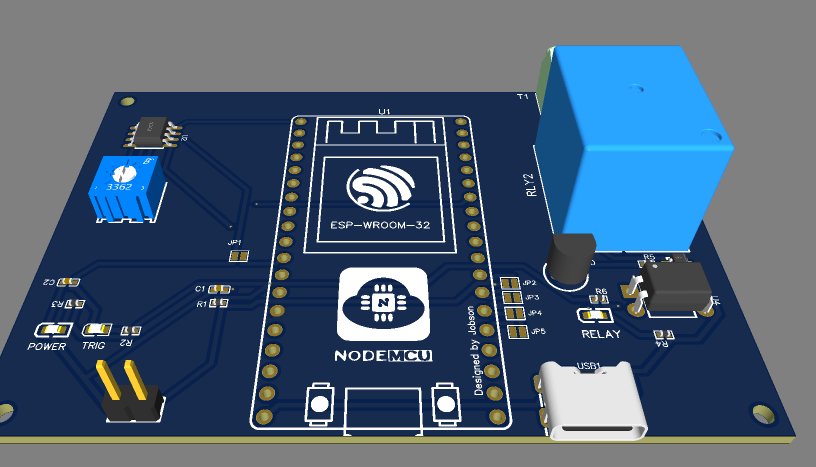
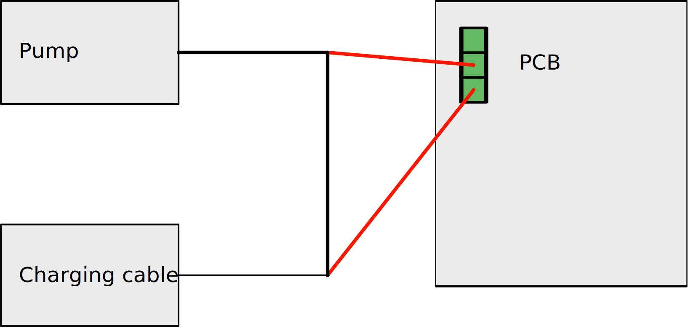

# Ordering PCBs on PCBWay

To order your PCBs from PCBWay, follow these simple steps:

## Step 1: Prepare Your Files

Make sure you have two files ready:

1. **Gerber File:** Located in folder "GERBER". The Gerber file contains the information necessary for PCB fabrication.

2. **BOM File:** Located in folder "BOM" on GitHub. The BOM (Bill of Materials) file lists all the components needed for the PCB assembly.

## Step 2: Go to PCBWay

Visit [PCBWay's Online Order Page](https://www.pcbway.com/orderonline.aspx) to get started.

## Step 3: Configure Your PCB

- Dimensions: 80x55 mm
- Number: [Specify the quantity you want]
- Layers: 2
- Thickness: 1.6mm

## Step 4: Add Assembly Service (optional)

If you need assembly services, follow these settings:

- Quantity: 20
- Contains Sensitive Components: Yes (water)
- Accept Alternatives/Substitutes Made in China: Yes

Click on "Calculate" to get the total cost.

## Step 5: Choose Shipping Method

Select the shipping method that suits your needs and click on "Save to Cart."

## Step 6: Upload Your Files

- Upload the **Gerber File** from folder "GERBER" on GitHub.
- Upload the **BOM File** from folder "BOM" on GitHub.

## Step 7: Submit Your Order

Click on "Submit Order Now" to proceed with your PCB order.

## Step 8: Wait for Approval

PCBWay will review your files for manufacturability. Once they pass the check, you'll receive a confirmation email.

## Step 9: Make the Payment

Follow the instructions in the email to make the payment for your order.

## Step 10: Receive Your PCBs

After the payment is confirmed, PCBWay will start manufacturing your PCBs. Once ready, they'll be delivered to your doorstep.

Enjoy your PCBs from PCBWay!

For any questions or support, you can visit their [Contact Page](https://www.pcbway.com/contact.html).

## Connecting the Pump to the PCB

To connect the pump to the PCB, follow these additional steps:

1. **Prepare the Wires:**
   Strip a small portion of the insulation from the black wire of the charging cable and the black wire of the pump. This will expose the metal conductors for connection.

2. **Connect Black Wires:**
   Connect the black wire of the pump to the black wire of the charging cable.

3. **Secure the Red Wire (Pump) Connection:**
   Connect the red wire of the charging cable to the 3rd screw hole on the PCB.
   Connect the red wire of the pump to the 2nd screw hole on the PCB.

4. **Insulate Connections:**
   After connecting the wires, use electrical tape or heat-shrink tubing to insulate and protect the exposed connections. This will prevent any accidental short circuits and ensure safety.

5. **Double-Check Connections:**
   Before proceeding, double-check all connections to ensure they are secure and properly insulated. Any loose connections or exposed wires could lead to malfunctions or safety hazards.

6. **Route Wires Neatly:**
   Arrange the connected wires in a neat and organized manner, avoiding any tangles or sharp bends. This will help prevent strain on the connections and maintain the overall integrity of the setup.

7. **Test the Connection:**
   Before finalizing the setup, power on the system and test the pump to ensure it functions correctly. Observe any unusual behavior or issues during this test.

8. **Safety Check:**
   Once everything is connected, perform a final safety check. Ensure that no wires are exposed, all connections are secure, and the system is properly insulated. This step is crucial for preventing potential hazards.

By following these additional steps, you can ensure a safe and reliable connection between the pump and the PCB in your setup.
